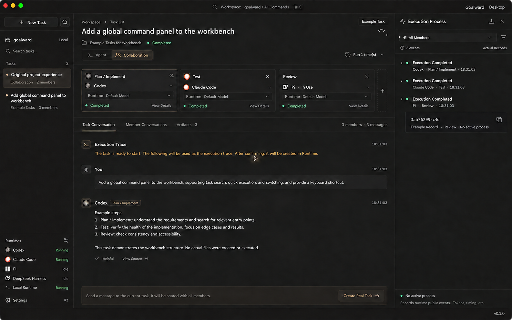

# Goalward

Goalward helps turn a vague ambition into work you can finish and review. Shape a direction into a goal, break it into tasks, use local coding agents to do the work, and decide what to do next from the results.

**Goal → Tasks → Execution → Artifacts and evidence → Review → Next actions**

Goalward is also a desktop proxy for coding agents: run them individually or together, route work to the right agent, and follow each execution trace without losing the goal behind it.

**Supported agents:** Codex · Claude Code · Kimi CLI · Pi · DeepSeek Harness · Custom CLI runtimes



## Download

Goalward runs on Apple Silicon and Intel Macs with macOS 13.3 or later. Each macOS download is a universal app that includes both architectures.

[Download the DMG or ZIP and read release notes](https://github.com/Beace/goalward/releases)

Each published prerelease includes commit-based changes and SHA-256 checksums. Check the notes and checksums before installing.

The app does not include agent CLIs, model weights, subscriptions, or API credentials. Install and sign in to at least one supported agent before using it.

## Install on macOS

Open the DMG, drag **Goalward.app** into **Applications**, and launch it. If you use the ZIP, extract it and move the app into **Applications**. The release is not notarized; if macOS blocks the first launch, review the warning in **System Settings → Privacy & Security**.

Builds with the updater check public GitHub Releases at startup and every six hours, including published prereleases. Open **Settings → App updates** to check manually, download a signed update, install it, and restart when ready. Installation and restart require idle agents and saved settings; checks and downloads can run while you work. Update signatures verify the package and version against the app's embedded public key. They do not replace Apple Developer ID signing or notarization.

Versions published before updater support, including `v0.2.0`, need one manual installation of an updater-capable release. Updates keep the existing workspace data directory. Install the app in **Applications** and eject the DMG before updating; a read-only disk image cannot be updated in place. Browser previews and development builds cannot install app updates.

## Get started

1. **Connect an agent.** On first launch, review the detected runtimes, import one, and choose a default. If yours is missing, install and sign in to it, scan again, or set its executable path in **Settings → Runtimes**.
2. **Make a goal concrete.** Start with the direction you have, even if it is still broad. Describe the outcome, constraints, and what would count as progress; then add a first task with an acceptance criterion. Choose a working directory if the task will use local files.
3. **Do the work.** Pick an agent or a collaborating group, review its permissions, and send an instruction. Goalward keeps the conversation and execution trace with the task.
4. **Review and continue.** Check the output, artifacts, and evidence before accepting the task. Record what changed and create the next task, revise the goal, or mark it achieved when its criteria are met.

A finished agent process does not automatically mean a task is accepted. You can also create goals and tasks for work you will do manually.

Choose **System**, **Dark**, or **Light** in **Settings → Appearance → Theme**. System is the default and follows changes to your operating system's appearance while Goalward is open. An explicit Dark or Light choice remains fixed until you change it. Theme, font, and language changes apply immediately and save automatically; they persist across restarts and apply throughout the app.

Goalward starts in Chinese or English based on your Mac's language; other system languages use English. To choose manually or return to the system default, use **Settings → Appearance → Language**. Runtime, model, execution, and storage configuration changes still use **Save Changes**. Changing appearance saves only appearance preferences and leaves other unsaved configuration edits in your draft.

## Data

Goalward stores workspace data locally in `~/Library/Application Support/dev.goalward.desktop/`. Quit the previous app before the first launch. Goalward preserves its data directory and attempts a non-destructive migration; do not remove the old directory while existing attachments may still refer to it.

## Build from source

On a Mac with macOS 13.3 or later, install Node.js `^20.19.0`, `^22.12.0`, or `>=24.0.0`, npm, Rust stable, Cargo, and Xcode Command Line Tools. Then run:

```bash
npm ci --registry=https://registry.npmjs.org
npm run mac:dev
```

Build a local app with `npm run mac:build`. Run checks with `npm run build`, `npm test`, and `cargo test --manifest-path src-tauri/Cargo.toml`. On an Apple Silicon Mac, create the universal DMG, ZIP, checksums, and build metadata with `npm run mac:dist` (Python 3.10 or later required).

For contributions, create a new branch and Pull Request rather than pushing to `main`; see the [development and release process](docs/releasing.md).

## License

This repository does not currently contain a license. Until one is added, copyright law reserves reuse and redistribution rights to the copyright holder.
